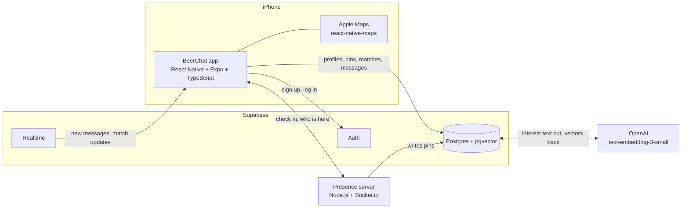

# Architecture

Milestone 0 version. This is the system context: what the pieces are and what talks to what. No internal design yet.

## System context

Same diagram as an image, for anything that does not render mermaid: [architecture.png](architecture.png).

The arrow between Postgres and OpenAI is a simplification. The embedding call runs somewhere server side (see "Still open"), never from the phone, so the API key never ships in the app.

## What each piece does

- **App**: everything the user touches. Map, check in, list of people at the venue, matching, chat. Talks to Supabase directly for most things.
- **Supabase Auth**: email and password accounts.
- **Postgres**: the five tables from the proposal. pgvector holds one embedding per profile for interest ranking.
- **Realtime**: pushes new messages and match changes to the app so chat works without refreshing.
- **Presence server**: comes in at Milestone 2. Keeps the "who is here" list live over sockets. Until then presence goes through Supabase Realtime.
- **OpenAI**: turns interest tags into vectors so we can rank people by overlap.

## Data

| Table | Columns |
|---|---|
| Profile | id, display_name, interests[], created_at |
| Venue | id, name, latitude, longitude |
| Pin | id, user_id, venue_id, status, discoverable |
| Match | id, user_a, user_b, venue_id, status |
| Message | id, match_id, sender_id, text, created_at |

Exact GPS never gets stored. The only location the backend ever sees is a venue id.

## Still open

- Where the OpenAI call lives: a Supabase edge function or the Node server.
- How long messages stick around before they expire.
- Whether presence moves fully to Socket.io at Milestone 2 or stays split with Supabase Realtime.
