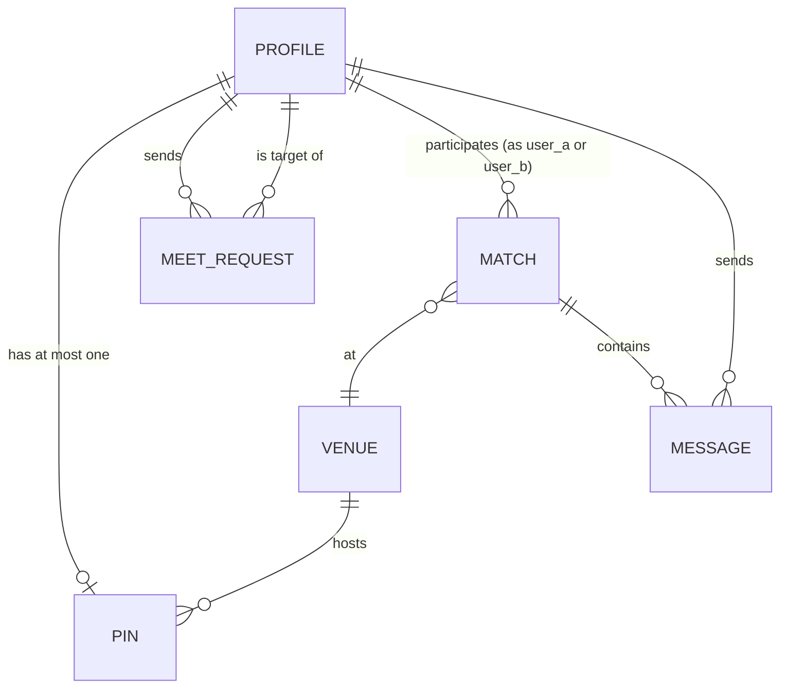
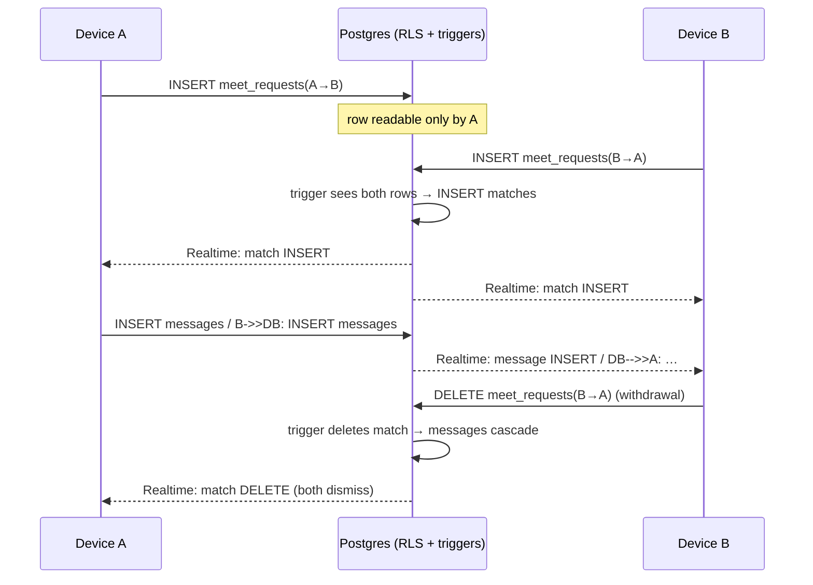

# Milestone 1 Design

As-built design for the MVP. Complements [ARCHITECTURE.md](ARCHITECTURE.md) (system context, unchanged) with the internal design that now exists.

## 1. Software process model

**Incremental development with feature-gated steps** (a lightweight Scrum variant). The plan ([PLAN.md](PLAN.md)) divides the product into Steps 0–8; each step ends with an observable two-device acceptance test and a git commit, and the app is runnable after every step — which is exactly the course's agile delivery requirement. Steps 1–5 (= backlog items BC-01…07) constitute Milestone 1. We chose this over timeboxed sprints because the team codes in irregular sessions around class schedules; gating on *demonstrable behavior* rather than dates kept every merge shippable. AI-assisted development (Claude Code as an orchestrating pair-programmer) was used throughout, with every generated change reviewed, tested on-device, and committed by a team member.

**Definition of Done** (every backlog item):
1. TypeScript compiles with no errors (`npx tsc --noEmit`).
2. The step's acceptance test passes in the two-simulator run.
3. Privacy rules are enforced in the database (RLS), not only in the UI.
4. Committed with a message referencing the step; bug fixes get a [BUGLOG.md](BUGLOG.md) entry (symptom / cause / fix).

## 2. Analysis model

### Data (entity-relationship)

Key structural decisions: `PIN.user_id` is the **primary key** (one pin per user; leaving = row deletion). `MATCH(user_a, user_b)` is stored ordered (`user_a < user_b`) with a unique constraint, so a pair can match at most once. `MESSAGE.match_id` has `ON DELETE CASCADE`: messages cannot outlive consent.

### Behavior: pin lifecycle (state machine)
```
(no pin) --"I'm heading there"--> heading --"I'm here"--> arrived --"Leave"--> (no pin)
   discoverable: false by default; may be toggled in heading or arrived
   visibility to others = (discoverable = true), enforced by RLS
```

### Flow: the matching sequence


## 3. Module boundaries and design classes

```
app/src/
├── app/
│   ├── _layout.tsx      expo-router shell
│   └── index.tsx        AUTH GATE: session → profile → home routing
│                        + SignInScreen + ProfileSetupScreen
├── components/
│   ├── MapHome.tsx      HOME: map, venue sheet, pin lifecycle, status card,
│   │                    venue-list fallback (BC-11); owns both realtime
│   │                    channels and all pin/match state
│   ├── PeopleHere.tsx   presence list + "Open to meet?" (props-driven)
│   ├── MatchScreen.tsx  match reveal overlay (pure presentational)
│   └── ChatScreen.tsx   chat: history fetch + live INSERT subscription
└── lib/
    ├── supabase.ts      the single Supabase client (auth persistence config)
    └── theme.ts         design tokens (colors) shared by every screen
```
Boundary rule: **only `MapHome` owns realtime subscriptions and mutation state**; `PeopleHere`/`MatchScreen`/`ChatScreen` are children driven by props and callbacks (ChatScreen holds only its own message subscription). `lib/` has no UI; screens never construct their own client.

## 4. API / interface contract

The app's server interface is the Supabase schema; **RLS policies are the contract**. No custom HTTP endpoints exist in M1.

| Table | Operation (client) | Allowed when (RLS) |
|---|---|---|
| profiles | select / update / insert | own row; **select** also allowed while the owner has a discoverable pin |
| venues | select | any signed-in user |
| pins | insert / update / delete / select | own row; **select** of others only where `discoverable = true` |
| meet_requests | insert / select / delete | requester = self (targets can never read them) |
| matches | select | participant (user_a or user_b); created/deleted **only by triggers** |
| messages | select / insert | match participant; insert additionally requires sender = self |

Server-side logic (Postgres triggers, `SECURITY DEFINER`): auto-create profile on signup; create match when both request directions exist; delete match when either request is withdrawn.

Realtime channels: `postgres_changes` on pins / matches / messages (RLS-filtered per subscriber), plus one **data-free broadcast** ("pins changed — refetch") because RLS correctly suppresses UPDATE events whose new row the subscriber may no longer see (documented in [BUGLOG.md](BUGLOG.md)).

## 5. Component designs for two key use cases

### UC-3 Presence (BC-04/05)
`MapHome` holds `pin`, `counts`, and a `pinsVersion` counter. Every mutation (`headThere`, `imHere`, `leave`, `toggleDiscoverable`) writes the row, then sends the broadcast. Both event sources (`postgres_changes` and broadcast) simply bump `pinsVersion`; effects depending on it refetch own-pin, venue counts, and the people list. The pattern is **event → invalidate → refetch**: events carry no payload the UI trusts; the database answers every query under RLS, so the UI can never display data the viewer isn't entitled to.

### UC-4 Double opt-in matching (BC-06)
`PeopleHere` renders the request button from a locally fetched set of own outgoing requests (toggle = insert/delete of one row). Match detection lives in `MapHome`'s second channel: an INSERT event involving the current user triggers profile enrichment (`buildMatch`) and shows `MatchScreen`; a DELETE event with the current match id clears match, chat, and pill in one state update. The client never checks for reciprocity — it *can't* (RLS) — which makes the privacy property structural rather than behavioral.

## 6. Design patterns used

- **Observer (publish–subscribe):** Supabase Realtime channels push database change events to subscribed devices; UI state reacts to events rather than polling. Justification: presence and chat are inherently push-shaped; polling would either lag (slow) or hammer the free-tier database (fast).
- **Mediator (in the database):** the matching trigger is a mediator between two users who must not observe each other's intent; each talks only to the database, which alone holds both sides. Justification: any client-side implementation would require a client to read the other party's request, violating the privacy requirement by construction.
- Also notable: **Singleton** for the Supabase client (one configured instance in `lib/supabase.ts`), and the pin **State machine** (§2).

## 7. UX and cross-platform considerations

- Seven-screen dark-theme design: wireframes of all seven screens are Fig. 4 of the [Milestone 1 report](Milestone-1-Report.pdf); the full visual canvas is linked in [DESIGN.md](DESIGN.md). Implemented tokens live in `lib/theme.ts` — single source for colors.
- Multi-screen interface: sign-in → profile setup → map → venue sheet → people list → match → chat.
- One-handed, night-out ergonomics: ≥44 pt touch targets, bottom-anchored actions, short copy.
- Cross-platform: React Native + Expo compiles for iOS and Android from one codebase; all UI is stock RN components with safe-area handling. iOS is the M1 verification platform; the only platform-variant piece is map tiles (Apple Maps on iOS, Google fallback on Android). BC-11's venue list doubles as the no-map path.
- Accessibility baseline: contrast-checked dark palette (amber on near-black), text-based status redundancy for color cues.

## 8. Requirements traceability

| Backlog | Requirement | Where implemented | Verified by |
|---|---|---|---|
| BC-01/02 | auth + profile | `index.tsx`, profiles table + signup trigger | VERIFICATION §1–2 |
| BC-03 | venues on map | `MapHome` + venues seed migration | §4 |
| BC-11 | list fallback | `MapHome` list overlay | §3 |
| BC-04 | check-in + visibility | pins table, RLS, `MapHome` sheet | §5, §7 |
| BC-05 | who's here, live | `PeopleHere` + realtime | §6 |
| BC-06 | double opt-in | meet_requests/matches + triggers | §8–9, §11 |
| BC-07 | live 1-on-1 chat | `ChatScreen` + messages table | §10–11 |
